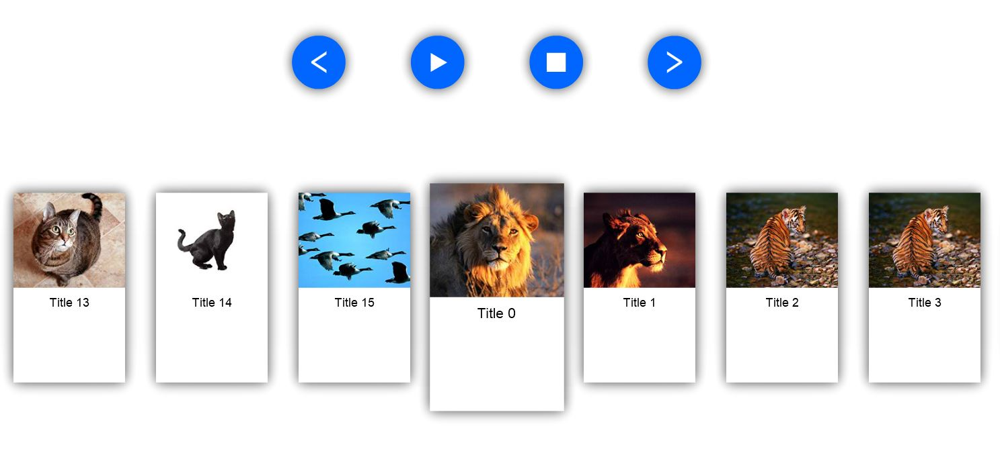

# SimpleCarousel

- Programming language: **ActionScript**
- Integrated development environment (IDE): **Adobe Animate**
- Intended platforms: **Web browsers**

## Description of the application

This is a looping carousel of 15 item classes showing 7 items at a time.
There are buttons to animate in/out and control the carousel. It can animate left and right.
Items marked with animation level 1 or greater have unique animations and audio events on selection.

